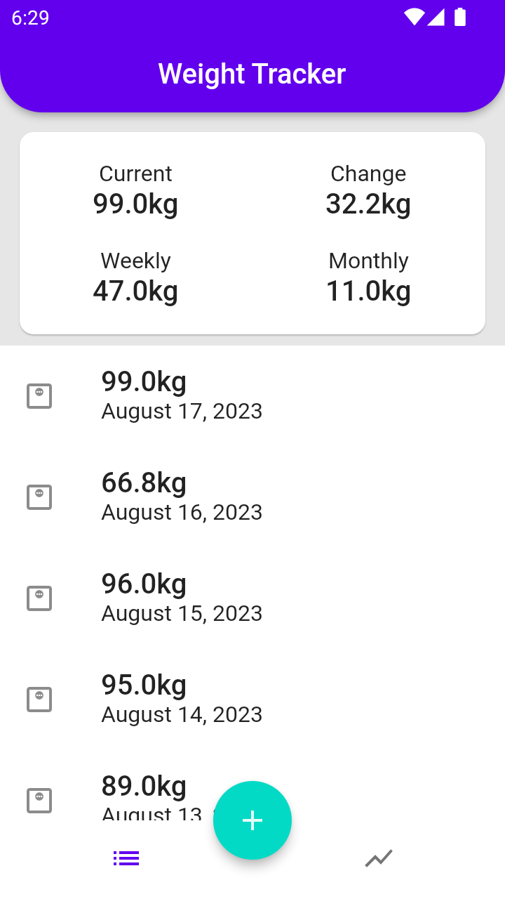
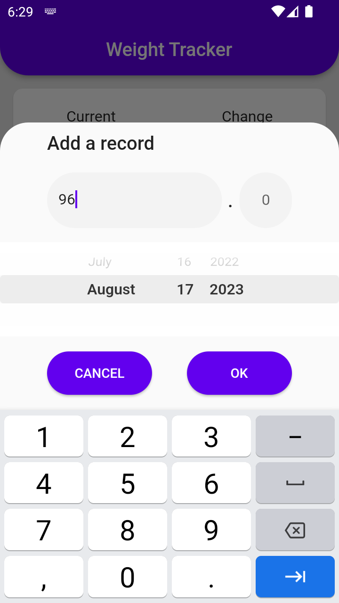
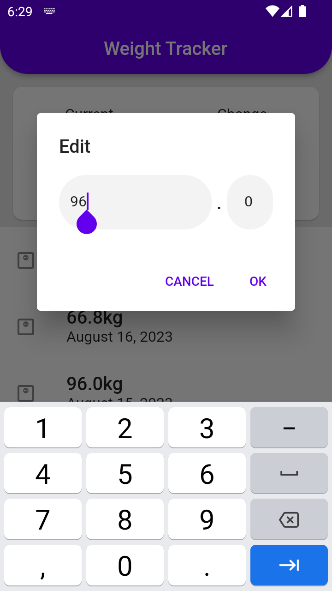
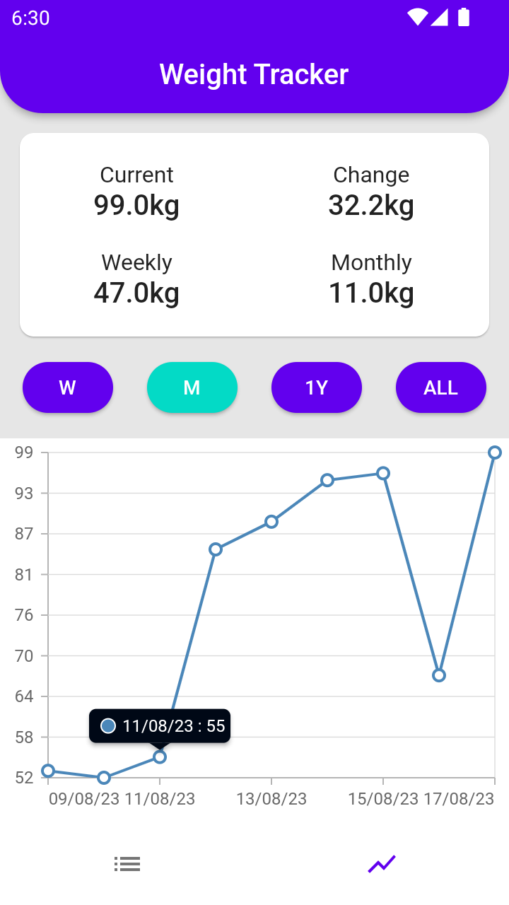

|            Screenshot            |            Screenshot            |
| :------------------------------: | :------------------------------: |
|  |  |
|  |  |

# Kilo Takibi Uygulaması

## Kilo Takibi Uygulaması Nedir?

Kulllanıcının manuel olarak girmiş olduğu kilo verileri ile kilosunu takip etmesini, grafik ile kilo grafiğini günlük, haftalık, aylık ve yıllık olmak üzere görmesini amaçlayan basit bir uygulamadır. Bu proje, benim Flutter ile yaptığım ilk projedir.

## Temel Özellikler:

+ Manuel input ile kilo verisi ekleyip listelenmesi.
+ Eklenen kilo verilerinin grafik yardımıyla gösterilmesi.
+ Anasayfadaki tablo yardımı ile kilo değişim verilerinin gösterilmesi.

## Kurulum:

    gh clone https://github.com/cusufcan/weight_track_app

## Ekran Görüntüleri:

<table>
  <tr>
    <td> </td>
    <td></td>
   </tr> 
   <tr>
      <td></td>
      <td>
  </td>
  </tr>
</table>

## Kullanılan Teknolojiler:

+ Flutter & Dart
+ Firebase
+ OneSignal
+ Scroll Date Picker
+ Shared Preferences
+ Syncfusion Flutter Charts
+ Flutter Native Splash

## Lisans:

    lisans
